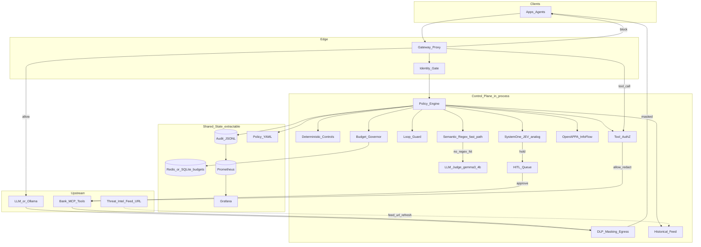
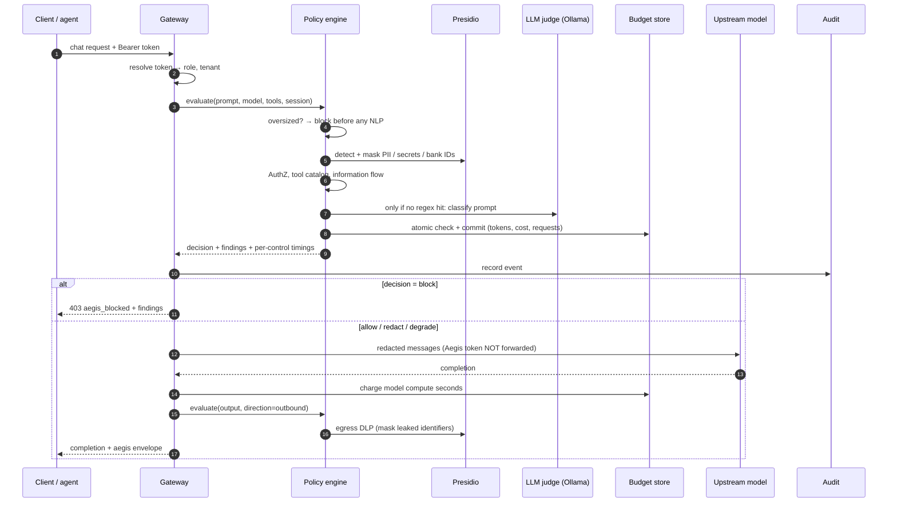
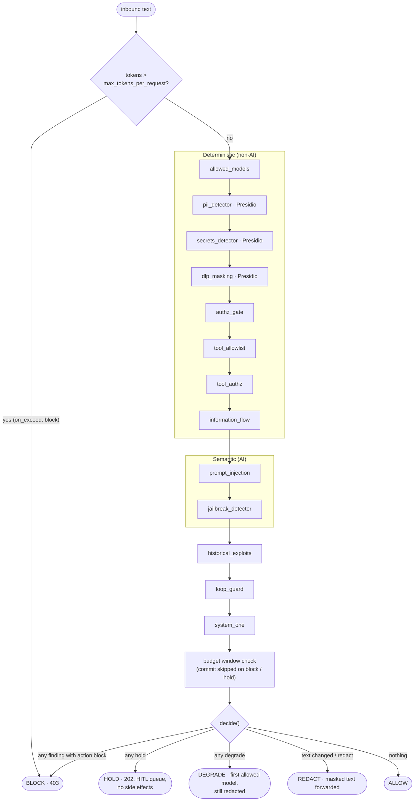
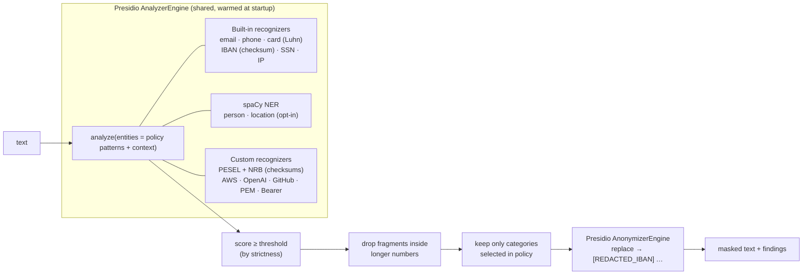
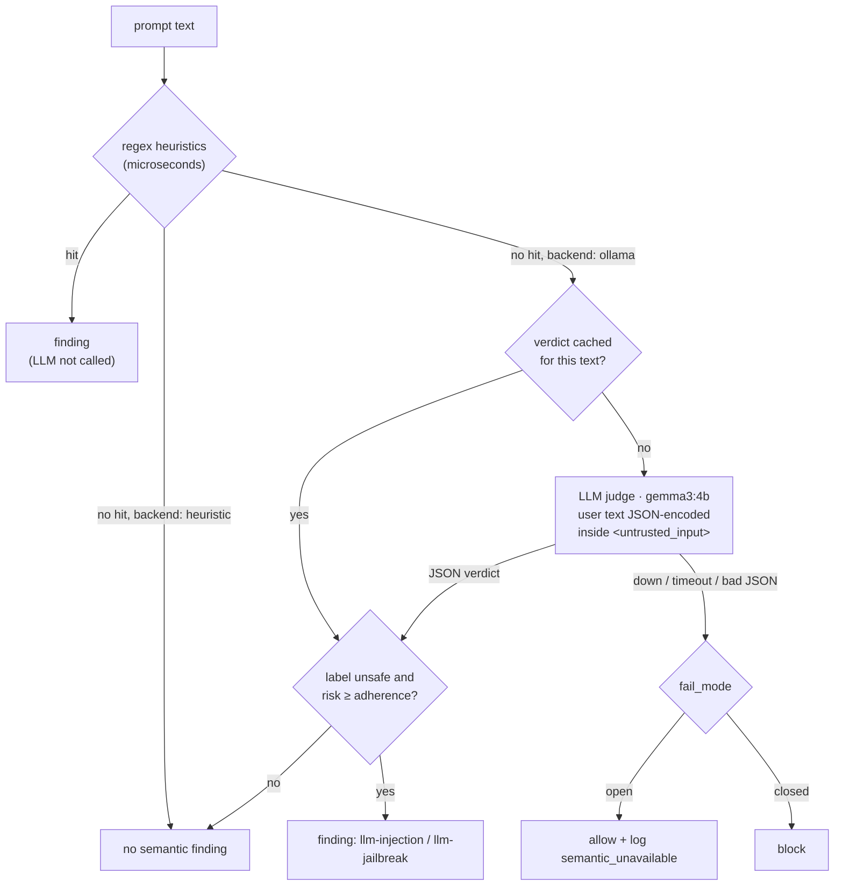
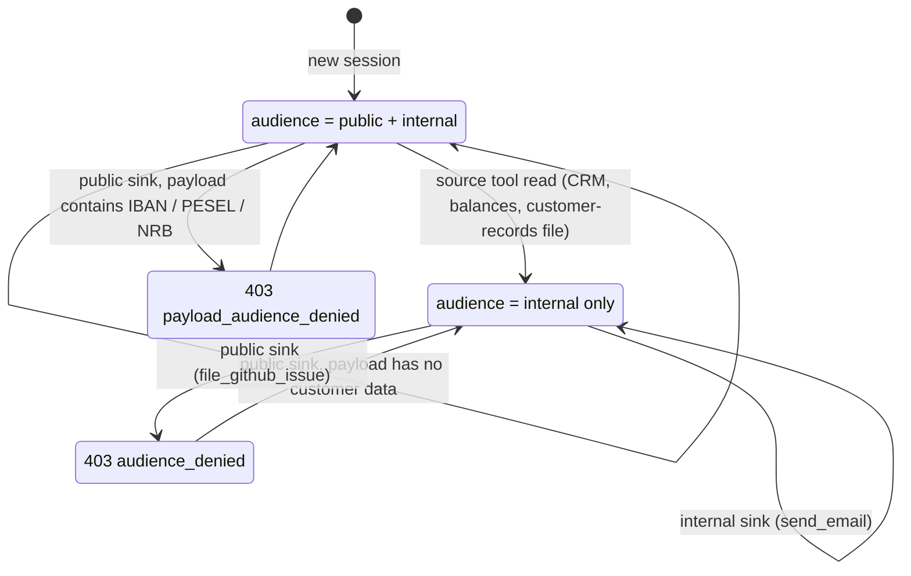
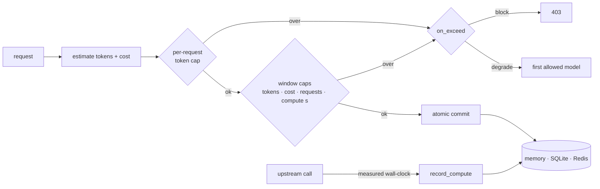
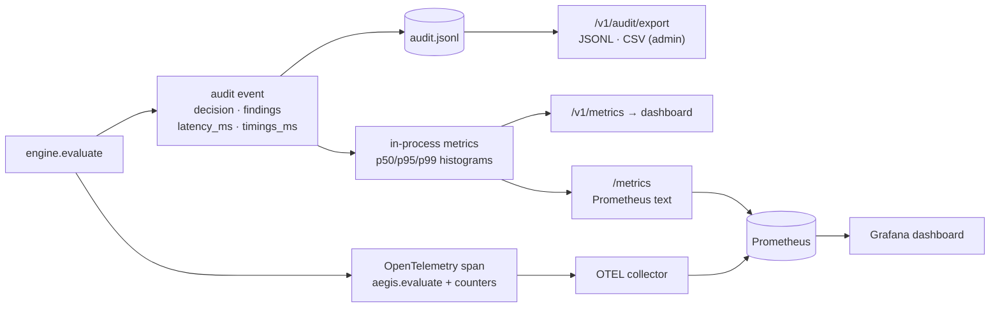
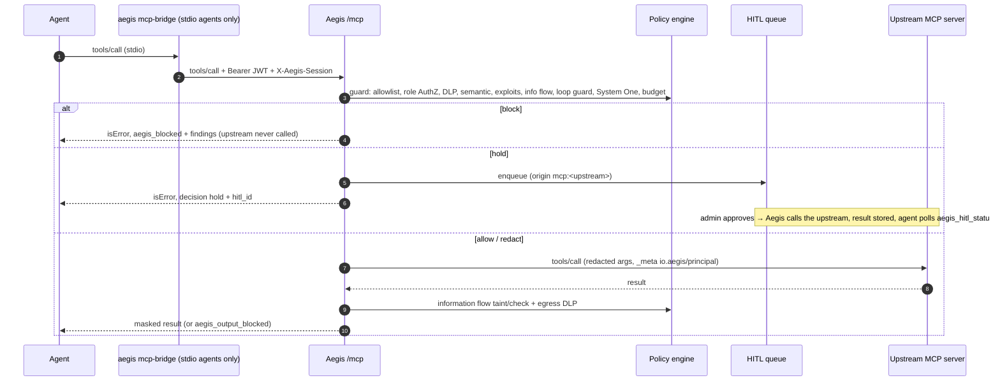

# Aegis architecture

Aegis is a Python **modular monolith**: one deployable process for the demo, with logical services that can be split out later (gateway replicas, Redis budgets, a shared policy mount).

Each diagram below answers one question:

| # | Diagram | Question it answers |
|---|---|---|
| 1 | [System overview](#1-system-overview) | What sits where? |
| 2 | [Request lifecycle](#2-request-lifecycle) | What happens to one chat request, step by step? |
| 3 | [Control pipeline](#3-control-pipeline) | In which order do controls run, and how is the decision made? |
| 4 | [Data controls (Presidio)](#4-data-controls-microsoft-presidio) | How are PII, secrets and bank identifiers found and masked? |
| 5 | [Semantic cascade](#5-semantic-cascade) | When is the LLM judge called, and what if it is down? |
| 6 | [Information flow](#6-information-flow-openappa-subset) | Why is a public post blocked after reading customer data? |
| 7 | [Budgets](#7-budgets) | What is limited and where is it stored? |
| 8 | [Observability](#8-observability) | Where do metrics, traces and audit logs go? |
| 9 | [MCP proxy](#9-mcp-proxy) | How does Aegis sit between an agent and its MCP servers? |

The policy file that drives all of these is documented separately in [policy-engine.md](policy-engine.md).

---

## 1. System overview

| Logical service | Responsibility | Module | Scale-out path |
|---|---|---|---|
| Gateway | OpenAI-compatible + MCP proxy; enforce allow/redact/block | `gateway.py` | N replicas behind LB |
| Identity gate | Bearer API tokens → role + tenant; never trust client-asserted identity | `identity.py` | later IdP / JWT |
| Policy engine | YAML load, mtime hot-reload, hybrid decide | `engine.py`, `policy/` | ConfigMap / policy service |
| Deterministic controls | AuthN/AuthZ gates, tool catalog | `controls/deterministic.py` | in-process |
| **DLP / masking** | Pattern-match PII, IBAN/account, PAN, secrets; **mask inbound and egress** | `controls/dlp.py` | dedicated egress step |
| **Tool AuthZ** | Role → function (e.g. only `teller`/`admin` may call `get_counterparty_balance`) | `controls/deterministic.py` | later OPA / policy service |
| **OpenAPPA IFC** | Per-session audience/trust label (caller + `X-Aegis-Session`); blocks public sinks after internal reads and classifies sink payloads | `controls/appa.py`, `information_flow` in `policies/policy.yaml` | later OpenAPPA sidecar |
| Semantic cascade | Regex fast path, then a local LLM judge (Ollama) with one cached call per request; `fail_mode` open/closed | `controls/semantic.py` | dedicated judge worker / GPU pool |
| **System One** | Typed allow/hold/block + calibrated probabilities (JEV analog). Heuristic logistic first; optional structured Ollama | `controls/system_one.py` | dedicated router |
| **HITL** | Pause `initiate_payment` (and strict counterparty reads) until admin approve/deny | `hitl.py`, dashboard | later workflow engine |
| **Loop guard** | Max tool hops / identical repeats per agent session | `controls/loop_guard.py` | shared session store |
| **Bank MCP** | In-process demo bank tools behind `/v1/mcp/invoke` (balances, CRM, payments) | `demo/bank.py` | real MCP host |
| Historical feed | `attack_signatures` in the policy file; optional external `feed_url` (last good copy kept) takes precedence while reachable; ReDoS-safe compiled patterns | `controls/historical.py` | threat-intel service |
| Budget governor | Token, cost, request and **compute-seconds** windows; one implementation over memory/SQLite/Redis | `controls/budget.py` | Redis (or SQLite) shared state |
| Audit + telemetry | Audit JSONL/CSV, per-control latency, p50/p95/p99, Prometheus histograms | `audit.py`, `observability.py`, `/` | Prometheus `/metrics` + Grafana |

---

## 2. Request lifecycle

One `POST /v1/chat/completions` that is allowed through to a real model:

---

## 3. Control pipeline

Controls run in a fixed order. Each one is timed (`timings_ms`). The decision is computed from all findings at the end.

Decision precedence: **block > hold > degrade > redact > allow**. Redaction still applies when the decision is `degrade`.

Step by step:

1. Authenticate (`Authorization: Bearer <token>` → role + tenant).
2. Load policy (mtime hot-reload from centralized YAML). See [policy-engine.md](policy-engine.md).
3. **Tool AuthZ** on every tool name in the payload (not only the first).
4. Hybrid inbound controls: deterministic + DLP + information flow + semantic (regex, then LLM judge) + historical + **loop guard** + **System One** + budget. Each control is timed.
5. Emit `allow | redact | block | degrade | hold`. **HOLD does not execute MCP.** Redact still applies when the overall decision is degrade.
6. Forward to upstream / bank tools only when not blocked or held, using `AEGIS_UPSTREAM_API_KEY`; the caller's token is never forwarded. Upstream wall-clock time is charged to the compute budget.
7. **Egress DLP** on model/tool output (string leaves) before return; tool results also taint OpenAPPA. Append audit (decision, findings, `latency_ms`, `timings_ms`, System One, HITL id).

---

## 4. Data controls (Microsoft Presidio)

| Where it runs | Purpose |
|---|---|
| `pii_detector` | Personal data in prompts |
| `secrets_detector` | Credentials in prompts (always high severity) |
| `dlp_masking` inbound | Customer and payment identifiers going **to** a model |
| `dlp_masking` outbound | The same identifiers leaking **from** a model or tool (egress) |
| `information_flow` | Classifies sink payloads as customer data |

Policy `patterns` choose the categories: `email`, `phone`, `ssn`, `credit_card`, `iban`, `pesel`, `account`, `person`, `location`, `ip_address` and the secret types. The score threshold follows `strictness`: high 0.30, medium 0.35, low 0.50.

---

## 5. Semantic cascade

At most one model call is made per unique text. Both semantic controls share the cached verdict.

---

## 6. Information flow (OpenAPPA subset)

Each agent session (caller token + optional `X-Aegis-Session`) carries a label. Labels only ever get more restrictive.

Tool contracts (sources, sinks, required audience) live in the `information_flow` section of `policies/policy.yaml`.

---

## 7. Budgets

All three storage backends share one window/check/commit implementation and differ only in storage. Compute seconds measure the real cost of local models; tokens and USD cover external APIs.

---

## 8. Observability

| Audience | Signal |
|---|---|
| Management | Dashboard posture, block rate, cost and compute; Grafana |
| Security team | Audit JSONL/CSV export with findings per event; traces with per-control timings |
| Performance review | `aegis_eval_latency_seconds`, `aegis_control_latency_seconds{control}`, `aegis_upstream_latency_seconds` |

---

## 9. MCP proxy

Aegis speaks MCP on both sides: agents connect to `/mcp` (Streamable HTTP, JWT bearer), or through `aegis mcp-bridge` (stdio), and Aegis connects to the real servers listed in `mcp.upstreams` of `policies/policy.yaml`.

| Piece | Module |
|---|---|
| Agent-facing MCP server, `/mcp` endpoint, JWT check | `mcp_proxy.py` (`McpProxy`) |
| Upstream connections (one long-lived client per server, lazy, reconnect on policy change) | `mcp_upstreams.py` (`UpstreamPool`) |
| Shared guard / output screening (also used by `/v1/mcp/invoke`) | `gateway.py` (`_guard_tool_call`, `_screen_tool_output`) |
| stdio bridge | `mcp_bridge.py` |
| Demo bank as a real MCP server | `demo/bank_mcp_server.py` |

---

## Deployment & profiles

- **Demo:** `aegis serve` or `docker compose up --build`. Observability stack: `docker compose --profile obs up --build`, then Grafana at http://localhost:3000.
- **Shared budgets:** `AEGIS_BUDGET_BACKEND=sqlite` (default) or `redis`.
- **Profiles:** all three live in `policies/policy.yaml`; pick one with `active_profile`, `AEGIS_PROFILE` or `aegis serve --profile`, and per tenant with `tenant_profiles`.

| Profile | Semantic layer | Intent |
|---|---|---|
| `permissive` | regex only | Prefer log/redact, high budgets, degrade on exhaustion |
| `balanced` | regex + LLM judge, fail-open | Default demo |
| `strict` | regex + LLM judge, fail-closed | Block first, small budgets |
