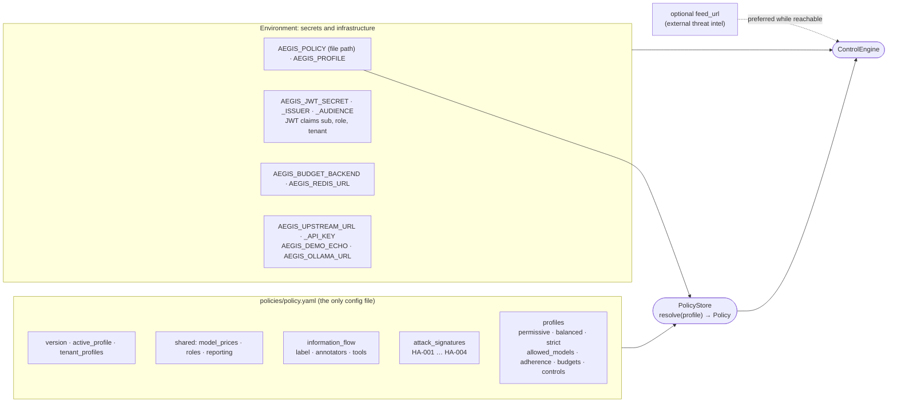
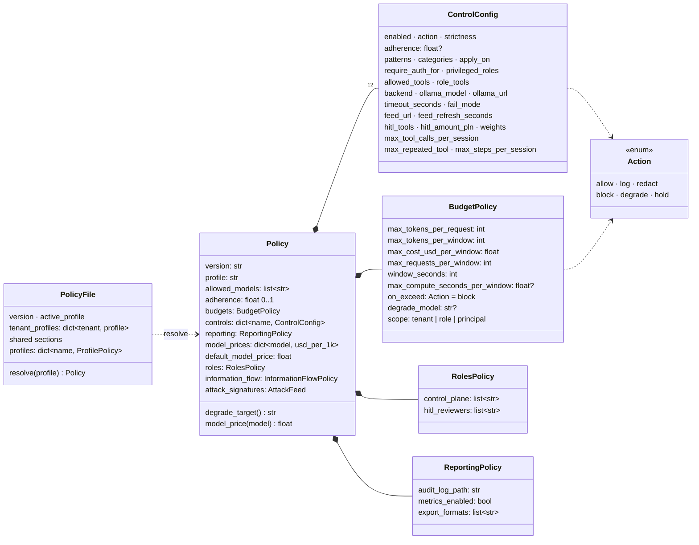
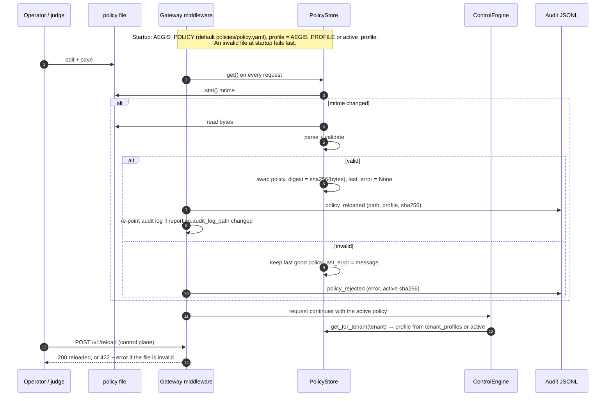
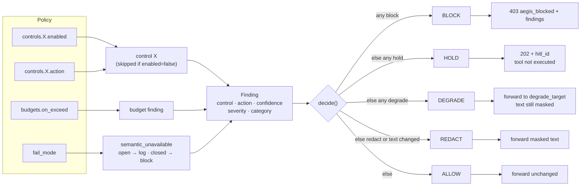
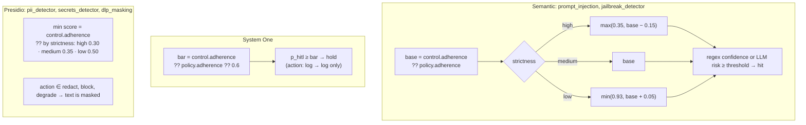
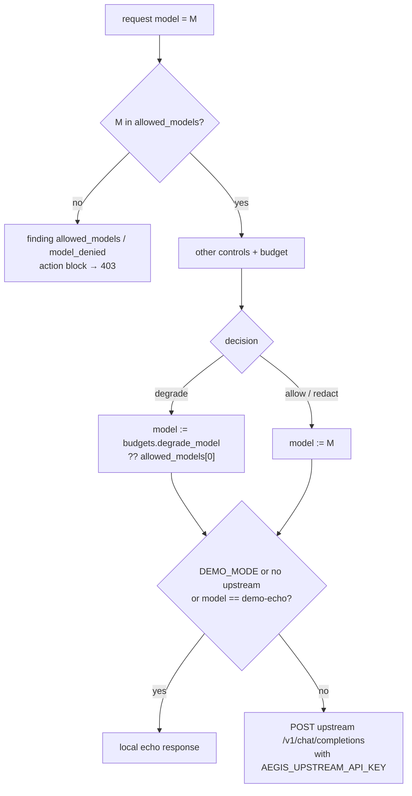
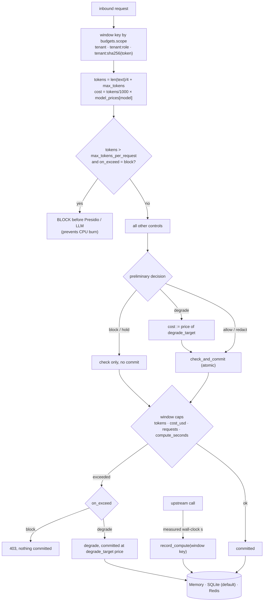

# Centralized Policy Engine

> **Requirement.** A single config source (e.g. file/system) managing controls, sensitivity thresholds (Block vs Redact or adherence %), allowed LLM models, and resource/financial budgets.

This document checks Aegis against that requirement, shows how the policy engine works, and lists every function that reads the policy. First audited at commit `f17f578` (2026-10-03). The gaps found then (G1–G10) are fixed; see [§12](#12-audit-findings-and-their-fixes).

| # | Section |
|---|---|
| 1 | [Compliance verdict](#1-compliance-verdict) |
| 2 | [Where configuration lives](#2-where-configuration-lives) |
| 3 | [Policy schema and validation](#3-policy-schema-and-validation) |
| 4 | [Load, hot reload and last-known-good](#4-load-hot-reload-and-last-known-good) |
| 5 | [From policy to decision](#5-from-policy-to-decision) |
| 6 | [Sensitivity thresholds](#6-sensitivity-thresholds-block-vs-redact-adherence) |
| 7 | [Allowed models](#7-allowed-models) |
| 8 | [Resource and financial budgets](#8-resource-and-financial-budgets) |
| 9 | [Control reference](#9-control-reference-which-keys-each-control-reads) |
| 10 | [Profiles compared](#10-profiles-compared) |
| 11 | [Control-plane API and operator runbook](#11-control-plane-api-and-operator-runbook) |
| 12 | [Audit findings and their fixes](#12-audit-findings-and-their-fixes) |

---

## 1. Compliance verdict

**Compliant.** All configuration lives in **one file, [`policies/policy.yaml`](../policies/policy.yaml)**: every profile, the information-flow contracts and the attack signatures. A strict schema validates it, and a mistyped control or misplaced field is rejected rather than silently ignored. The file is hot-reloaded, and a broken edit never replaces the active policy. Every audit event records which policy (SHA-256) produced it.

| Element of the requirement | Status | Evidence |
|---|---|---|
| Single config source (file/system) | ✅ | One file, `policies/policy.yaml`: the three profiles, `active_profile`, `tenant_profiles`, model prices, privileged roles, reporting, information-flow contracts and attack signatures. Path from `AEGIS_POLICY` (default `policies/policy.yaml`). Only secrets and infrastructure (tokens, storage backend, upstream URL) stay in env. |
| Manages controls | ✅ | `controls:` map, 12 known controls, each with `enabled` + `action`. Unknown names and fields that a control does not read are rejected. |
| Sensitivity: Block vs Redact | ✅ | `action: allow \| log \| redact \| block \| degrade \| hold` per control; `strictness: low \| medium \| high`. |
| Sensitivity: adherence % | ✅ | Global `adherence` is the confidence bar for semantic controls and System One; a control's own `adherence` overrides it. On Presidio controls, `adherence` sets the minimum detector score. |
| Allowed LLM models | ✅ | `allowed_models`; any other model is blocked. `budgets.degrade_model` (validated to be allowed) is the fallback on `degrade`. |
| Resource budgets | ✅ | Per-request tokens; per-window tokens, requests and **compute seconds**. Window per tenant, role or API token (`budgets.scope`). |
| Financial budgets | ✅ | `max_cost_usd_per_window` priced with `model_prices` from the same file; degraded requests are charged at the fallback model's price. |
| Hot reload | ✅ | mtime check on every request; `POST /v1/reload` forces it. An invalid file keeps the last good policy active. |
| Auditable | ✅ | `policy_sha256` on every audit event; `policy_loaded` / `policy_reloaded` / `policy_rejected` entries in the JSONL trail; `GET /v1/policy`, `/health`. |

Tests: [`tests/test_policy_engine.py`](../tests/test_policy_engine.py) has one or more tests per finding. Hot-reload, degrade, allowed-model and budget cases are also covered in `test_controls_positive_negative.py`, `test_agent_scenarios.py`, `test_gateway_http.py` and `test_hardening.py`.

---

## 2. Where configuration lives



| Section | Holds | Shared or per profile |
|---|---|---|
| `active_profile` | Profile for every tenant not listed below; `AEGIS_PROFILE` / `--profile` override it at start-up | — |
| `tenant_profiles` | Tenant → profile name | — |
| `model_prices`, `default_model_price` | USD per 1k tokens | Shared |
| `roles` | `control_plane`, `hitl_reviewers` | Shared |
| `reporting` | Audit log path, metrics switch, export formats | Shared |
| `information_flow` | OpenAPPA label, annotators, tool contracts (formerly `appa.toml`) | Shared |
| `attack_signatures` | Historical exploit signatures (formerly `feeds/historical_attacks.yaml`) | Shared |
| `mcp.upstreams` | Real MCP servers the `/mcp` proxy forwards to (stdio command or Streamable HTTP URL) | Shared |
| `profiles.<name>` | `allowed_models`, `adherence`, `budgets`, `controls` | Per profile |

The whole file is hot-reloaded as one unit, and `policy_sha256` covers all of it. Hard-coded defaults remain only where the file overrides them: the Presidio score per strictness (override: a control's `adherence`) and the semantic strictness offsets.

---

## 3. Policy schema and validation



Validation rules ([`policy/models.py`](../src/aegis/policy/models.py), `Policy._check_consistency`):

| Rule | Rejects |
|---|---|
| `extra="forbid"` on every model | Unknown keys anywhere (`budgets.max_tokenz`, top-level typos) |
| Control name ∈ `CONTROL_FIELDS` | `secrets_detectorr:`, a typo that would otherwise disable a control |
| Fields set on a control ⊆ what that control reads | `hitl_tools` on `pii_detector`, `adherence` on `authz_gate` |
| Ranges | `adherence` outside 0–1, budgets ≤ 0, negative prices |
| `budgets.degrade_model` ∈ `allowed_models` | Degrading onto a model that is not allowed |
| `active_profile`, `tenant_profiles` values ∈ `profiles` | Pointing at a profile that does not exist |
| Every `information_flow.tools[].annotator` is defined | A tool contract using an unknown classifier |
| `AEGIS_PROFILE` ∈ `profiles` | Starting with a profile that is not in the file |
| `allowed_models` non-empty | A policy with no usable model |

A control that is **absent** from the file does not run. Disable one explicitly with `enabled: false` so the intent is visible.

---

## 4. Load, hot reload and last-known-good



Code: [`policy/loader.py`](../src/aegis/policy/loader.py) `PolicyStore`; [`gateway.py`](../src/aegis/gateway.py) `_sync_policy_state`, `reload_policy`, `health`; [`engine.py`](../src/aegis/engine.py) `policy_for`.

* The engine reads the policy once per request, so one request always sees a consistent snapshot.
* A rejected file is not re-parsed on every request. It is retried on its next save.
* `/health` reports `status: degraded` together with `policy_error` while the file on disk is invalid.

---

## 5. From policy to decision

Each control turns policy into **findings**. A finding carries the `action` the policy assigned to that control. `decide()` folds all findings into a single decision, and the gateway maps that decision to an HTTP response.



`log` produces a finding that appears in the audit trail but never changes the decision.

| Decision | `/v1/chat/completions` | `/v1/mcp/invoke` | Budget committed? |
|---|---|---|---|
| `block` | 403 `aegis_blocked` | 403, tool not run | No |
| `hold` | 202 + `hitl_id` | 202, queued for control-plane approve/deny | No |
| `degrade` | Upstream called with `degrade_target`, masked | Tool runs with masked args | Yes, at the fallback model's price |
| `redact` | Masked messages forwarded | Tool runs with masked args | Yes |
| `allow` | Forwarded unchanged | Tool runs | Yes |

---

## 6. Sensitivity thresholds (Block vs Redact, adherence)

Two policy knobs set sensitivity:

* **What happens on a hit**: `action` per control.
* **When something counts as a hit**: `adherence` and `strictness`.



Global `adherence` is deliberately **not** applied to Presidio. Detector scores live on a different scale (a phone number scores about 0.4), so a single global bar would switch detectors off.

Effective thresholds in the shipped profiles (unchanged by the fixes; the global value is now the one that applies):

| Control | permissive | balanced | strict |
|---|---|---|---|
| Global `adherence` | **0.80** | **0.70** | **0.50** |
| `prompt_injection` | inherits, low → **0.85**, log | inherits, medium → **0.70**, block | inherits, high → **0.35**, block |
| `jailbreak_detector` | inherits, low → **0.85**, log | own 0.75 → **0.75**, block | inherits, high → **0.35**, block |
| `system_one` (p_hitl bar) | own **0.90**, log | own **0.60**, hold | own **0.45**, hold |
| Presidio PII score | low → **0.50**, redact | medium → **0.35**, redact | high → **0.30**, block |
| Presidio DLP score | medium → **0.35**, redact | high → **0.30**, redact | high → **0.30**, block |

A lower threshold makes a control more sensitive.

---

## 7. Allowed models



* Checked on inbound chat and `/v1/evaluate`. `/v1/mcp/invoke` evaluates as `demo-echo`, since a tool call has no model.
* The model actually used is recorded in `metadata.effective_model`.
* The semantic judge and System One models (`ollama_model`) are internal and not subject to `allowed_models`.

---

## 8. Resource and financial budgets



| Policy key | Meaning |
|---|---|
| `budgets.max_tokens_per_request` | Estimated tokens, one request |
| `budgets.max_tokens_per_window` | Estimated tokens per window |
| `budgets.max_cost_usd_per_window` | USD per window, priced from `model_prices` |
| `budgets.max_requests_per_window` | Requests per window |
| `budgets.max_compute_seconds_per_window` | Measured model wall-clock seconds per window |
| `budgets.window_seconds` | Window length |
| `budgets.on_exceed` | `block` or `degrade` |
| `budgets.degrade_model` | Fallback model on degrade (must be allowed) |
| `budgets.scope` | `tenant` (shared), `role` (per role in a tenant), `principal` (per API token) |
| `model_prices` / `default_model_price` | USD per 1k tokens; the default applies to models not listed |

Window state: `GET /v1/metrics` (`budget`, `budget_limits`) for the caller's window, and the OTEL budget gauges (scraped from the OTEL collector) for the default tenant. Reset with `POST /v1/demo/reset`.

---

## 9. Control reference: which keys each control reads

Every control also reads `enabled`, `action` and `strictness`. Setting any other key on a control is a validation error.

| Control | Family | Keys | Function |
|---|---|---|---|
| `pii_detector` | Deterministic, Presidio | `patterns`, `adherence` (min score) | `deterministic.scan_pii` |
| `secrets_detector` | Deterministic, Presidio | `patterns`, `adherence` | `deterministic.scan_secrets` |
| `dlp_masking` | Deterministic, Presidio | `patterns`, `adherence`, `apply_on` | `dlp.scan_dlp` (inbound and egress) |
| `authz_gate` | Deterministic | `require_auth_for` (glob), `privileged_roles` | `deterministic.check_authz` |
| `tool_allowlist` | Deterministic | `allowed_tools` (empty = allow all) | `deterministic.check_tools_allowlist` |
| `tool_authz` | Deterministic | `role_tools` (`"*"` = all) | `deterministic.check_tool_authz` |
| `information_flow` | Deterministic, OpenAPPA | — (contracts: top-level `information_flow`) | `appa.InformationFlowTracker.check_and_taint` |
| `prompt_injection` | Semantic | `adherence`, `backend`, `ollama_model`, `ollama_url`, `timeout_seconds`, `fail_mode` | `semantic.scan_prompt_injection` |
| `jailbreak_detector` | Semantic | same as above | `semantic.scan_jailbreak` |
| `historical_exploits` | Signature feed | `feed_url`, `feed_refresh_seconds`, `categories` (signatures: top-level `attack_signatures`) | `historical.scan_historical` |
| `loop_guard` | Deterministic, session | `max_tool_calls_per_session`, `max_repeated_tool`, `max_steps_per_session` | `loop_guard.LoopTracker.check` |
| `system_one` | Router | semantic keys + `hitl_tools`, `hitl_amount_pln`, `weights` | `system_one.evaluate_system_one` |
| *(top)* `allowed_models` | — | — | `budget.model_allowed` |
| *(top)* `budgets`, `model_prices` | Resource | see §8 | `budget._WindowedBudgetTracker`, `budget.estimate_cost_usd` |
| *(top)* `roles` | Access | `control_plane`, `hitl_reviewers` | `gateway._is_control_plane`, `gateway._hitl_reader` |
| *(top)* `reporting` | Reporting | `audit_log_path`, `metrics_enabled`, `export_formats` | `gateway._sync_audit_path`, `/v1/metrics`, `export_audit` |
| *(top)* `tenant_profiles` | Multi-tenant | tenant → profile name | `PolicyStore.get_for_tenant` |
| *(top)* `information_flow` | OpenAPPA | `label`, `annotators`, `tools` | `appa.InformationFlowTracker.use_policy` |
| *(top)* `attack_signatures` | Signature feed | `signatures[]` | `historical.FeedStore.load` |

Run order is fixed in code (see [architecture §3](architecture.md#3-control-pipeline)), not set by the policy.

---

## 10. Profiles compared

| Setting | permissive | balanced (default) | strict |
|---|---|---|---|
| `allowed_models` | demo-echo, gemma3:270m, gemma3:4b, qwen3:8b, gpt-4o-mini | demo-echo, gemma3:4b, qwen3:8b, gpt-4o-mini | demo-echo, gemma3:4b |
| Global `adherence` | 0.80 | 0.70 | 0.50 |
| Tokens / request | 8 192 | 4 096 | 2 048 |
| Tokens / window | 200 000 | 50 000 | 20 000 |
| USD / window | 10.0 | 2.0 | 0.5 |
| Requests / window | 500 | 100 | 40 |
| Compute s / window | 3 600 | 600 | 120 |
| `on_exceed` | degrade → **gemma3:270m** | block | block |
| Budget `scope` | tenant | tenant | **principal** (per token) |
| PII | redact, low | redact, medium | **block**, high |
| Secrets | redact | block | block |
| AuthZ gate / tool allowlist / tool AuthZ | off | block | block (developer limited to 3 tools) |
| DLP | redact | redact | **block** |
| Injection / jailbreak | log, regex only | block, regex + LLM, fail-open | block, regex + LLM, **fail-closed** |
| Historical exploits | block (3 categories) | block (4) | block (4) |
| Information flow | block | block | block |
| System One / HITL | log, > 50 000 PLN | hold, > 1 000 PLN | hold, **every** payment + counterparty reads |
| Loop guard (tools / repeats / steps) | log 80/20/200 | block 8/3/40 | block 6/2/20 |
| Control-plane roles / HITL reviewers | admin, security / teller | same | same |

---

## 11. Control-plane API and operator runbook

| Endpoint | Auth | Purpose |
|---|---|---|
| `GET /health` | none | `status` (`ok` / `degraded`), profile, `policy_path`, `policy_sha256`, `policy_error`, `profiles`, `tenant_profiles`, enabled controls, feeds |
| `GET /v1/policy` | `roles.control_plane` | Full effective root policy as JSON |
| `POST /v1/reload` | `roles.control_plane` | Force reload of root and tenant files; **422** with the error if the file is invalid (old policy stays active) |
| `GET /v1/metrics` | any token | Caller's budget window vs `budget_limits`; 404 if `reporting.metrics_enabled: false` |
| `GET /v1/audit/export?fmt=jsonl\|csv` | `roles.control_plane` | Audit trail incl. `policy_sha256` and policy load events |

Change the policy:

```bash
# 1. pick a profile at start (default: active_profile in the file)
AEGIS_PROFILE=strict .venv/bin/aegis serve      # or: aegis serve --profile strict · make serve PROFILE=strict
# 2. or edit the file; the next request picks it up
$EDITOR policies/policy.yaml
# 3. check it was accepted (status "ok", new sha256) or rejected (status "degraded" + error)
curl -s localhost:8080/health | jq '.status, .profile, .policy_sha256, .policy_error'
# 4. optional: validate offline before deploying
.venv/bin/python -c "from aegis.policy import load_policy; [load_policy('policies/policy.yaml', p) for p in ('permissive','balanced','strict')]; print('ok')"
```

Give one tenant a different profile:

```yaml
tenant_profiles:
  retail-bank: strict
```

`model_prices`, `roles`, `reporting`, `information_flow` and `attack_signatures` are shared by all profiles.

---

## 12. Audit findings and their fixes

Findings from the 2026-10-03 audit (G11 added after review). Each fix has a test in [`tests/test_policy_engine.py`](../tests/test_policy_engine.py).

| ID | Finding | Fix | Test |
|---|---|---|---|
| G1 | A typo in a control name loaded silently and disabled that control. | Control names are validated against `CONTROL_FIELDS`. | `test_negative_unknown_control_name_rejected` |
| G2 | One invalid edit made every request fail (HTTP 500). | `PolicyStore` keeps the last good policy and exposes `last_error`. `/health` reports `degraded`, `/v1/reload` returns 422, and the rejection is audited. | `test_invalid_edit_keeps_last_good_policy`, `test_gateway_keeps_serving_on_invalid_policy` |
| G3 | Model prices and privileged roles were hard-coded. | `model_prices`, `default_model_price` and `roles` live in the YAML. Presidio thresholds can be overridden per control. | `test_model_prices_from_policy`, `test_roles_from_policy` |
| G4 | Global `adherence` had no effect. | It is now the fallback for semantic controls and System One. Profiles inherit it instead of overriding it, with the same effective thresholds. Presidio controls accept a per-control `adherence` as their minimum score. | `test_global_adherence_drives_semantic_threshold`, `test_system_one_falls_back_to_global_adherence`, `test_presidio_adherence_is_min_score` |
| G5 | Fields that do not apply to a control were silently ignored. | Each control accepts only the keys it reads. | `test_negative_field_on_wrong_control_rejected` |
| G6 | Budgets were per tenant only, and a degraded request was charged at the original model's price. | `budgets.scope: tenant \| role \| principal`. A degraded request is charged at the fallback model's price inside the same atomic commit. | `test_budget_scope_principal_separates_tokens`, `test_degrade_uses_degrade_model_and_its_price` |
| G7 | `audit_log_path` changed only on `/v1/reload`; `metrics_enabled` was ignored. | The gateway middleware applies `audit_log_path` on every hot reload. `metrics_enabled: false` turns off `/v1/metrics` (Prometheus metrics come only from the OTEL collector since #13). | `test_audit_path_and_policy_hash_follow_hot_reload`, `test_metrics_disabled_by_policy` |
| G8 | Nothing showed which policy produced a decision. | `policy_sha256` is on every audit event (JSONL and CSV). Policy loads, reloads and rejections are written to the trail. | `test_audit_path_and_policy_hash_follow_hot_reload` |
| G9 | Degrade fell back to `allowed_models[0]`, i.e. `demo-echo`. | Explicit `budgets.degrade_model`, validated against `allowed_models` (permissive: `gemma3:270m`). | `test_negative_degrade_model_must_be_allowed`, `test_degrade_uses_degrade_model_and_its_price` |
| G10 | One policy per process. | `tenant_profiles` maps a tenant to a profile in the same file. | `test_tenant_profile_overrides_active` |
| G11 | Configuration was split over five files (three profiles, `appa.toml`, the attack feed). | Everything merged into `policies/policy.yaml`: profiles under `profiles:`, shared sections at the top. The hash and hot reload cover the whole configuration. | `test_single_policy_file_holds_everything`, `test_profile_selection`, `test_information_flow_contracts_hot_reload` |

**Known limits:**

* Identity comes from JWT claims (`sub`, `role`, `tenant`), verified with `AEGIS_JWT_SECRET` / `_ISSUER` / `_AUDIENCE`. The signing secret does not belong in a policy file that is readable through `GET /v1/policy`.
* The semantic strictness offsets (±0.15 / +0.05) are code defaults. A per-control `adherence` together with `strictness: medium` sets an exact threshold.
* An external `feed_url`, when configured, is outside the file by design (a feed owned by a threat-intel team). Its status is on `/health`; the in-file signatures are the fallback.
